= Rulebook
Bits AS
v1.1.0
:description: Enhanced Peppol eDelivery as communication infrastructure for financial messages in ISO 20022
:doctype: book
:icons: font
:toc: left
:source-highlighter: coderay
:toclevels: 2
:sectanchors:
:sectnums:

{description}

:leveloffset: +1

= Document information

== Change History

[cols="1,1,3,1", options="header"]
|===
| Date
| Version
| Reason
| Author

| 14.02.2017
| 0.2
| Initial draft. Outline of content and draft text for sections 2,3 and 4.
| Jostein Frømyr

| 23.02.2017
| 0.3
| Updates to sections 2 and 3 following comments received during the project team meeting on February 17.
| Jostein Frømyr

| 01.03.2017
| 0.4
| Updates to 3.1. Updates and new text added to section 4. New text added for section 5.
| Jostein Frømyr

| 08.03.2017
| 0.5
| Updates following comments received during the project team meeting on March 3. +
Additional text for sections
| Jostein Frømyr

| 16.03.2017
| 0.6
| Updates following comments received during the project team meeting on March 10.
| Jostein Frømyr

| 03.04.2017
| 0.7
| Restructured and updated content based on comments received. Added new section 10.
| Jostein Frømyr

| 19.04.2017
| 0.8
| Updates following comments received during the project team meeting on April 7.
| Jostein Frømyr

| 16.05.2017
| 0.9
| Updates following comments received during and in between project team meetings.
| Jostein Frømyr

| 07.06.2017
| 0.91
| Updates following comments received during project team meeting on June 2.
Final version approved by Bits as basis for PoC.
| Jostein Frømyr

| 25.10.2017
| 0.92
| Updated based on comments from PoC. Besides some minor editorial corrections, the following issues has been addressed in this version: 7, 8, 17, 20, 22, 23, 24 and 31.
| Jostein Frømyr

| 22.11.2017
| 0.93
a| Updated based on comments from PoC. Besides some minor editorial corrections, the following issues has been addressed in this version:

*	Issue 18 related to ref [25]. Reference removed.
*	[3] removed as covered by [12]
*	Updated links to external documents
*	Updated list of terms and abreviations
| Jostein Frømyr

| 05.01.2018
| 0.94
| Not distributed
| Jostein Frømyr

| 09.05.2018
| 0.95
a| Updated based on comments from PoC and work related to onboarding. Besides some minor editorial corrections, the following issues has been addressed in this version:

* Added source for [23] and [24] (section 1.2)
* Re-phrased the definition of Peppol Participant (section 1.3 and 6)
* Updates to the governance procedures (section 1.5)
* Clarification regarding use of bank certificates (new section 7.1)
* Clarification regarding the use of RC4 and RC4b (section 8.2.7)
* Clarification on how different certificates are carried in the ASiC-E archives (new section 8.3.1)
* Updates to reflect recent agreements related to the Peppol Agreement Framework (section 9.3)
| Jostein Frømyr

| 29.09.2018
| 1.0.0
| Bi-weekly collaboration meeting decides to elevate version 0.95 to version 1.0.0.
|

| 15.02.2021
| 1.0.1
a| Updates related to CertPub:

* Updating link to CertPub documentation (1.2).
* Removing "BCP" from list of terms and abbreviations (1.3).
* Added CertPub Locator as role in messaging and transport domain (6).
* Updating CertPub Publisher information (8.2.3).
* Added CertPub Locator information (8.2.4).
* Updated references to Business Certificate Publisher (BCP) to CertPub, CertPub Publisher, CertPub services.

Metadata:

* Updated definitions and clarifications in Metadata file (8.2.7).
* Clarification on use of multiple signatures on inner ASiC in Signing, sealing and encryption (8.3.1).

Other:

* Removing information about who is hosting Peppol SML (6, 8.2.1).
* Updated definition of "Peppol Participant" in Terms and abbreviations (1.3).
* Updated links formerly pointing to difi.no (1.2).
* Updated references to Difi.
* Removing references to AS2 (1.2).
* Removing information regarding SREST (8.4.2).
* Adding appendix B.

Additional changes based on review are documented as a link:attachments/review-2021q1.pdf[separate document].

| Erlend Klakegg Bergheim +
Lars Fixdal

| 02.04.2025
| 1.1.0
a| The following updates have been made in connection with the removal of SBDH validation:

* Minor version.
* Links in the reference list have been corrected.
* Internal references within the document have been reviewed and updated.
* Minor adjustments and corrections.
* Avoid using the term "inner SBDH" to prevent confusion with the inner and outer ASiC structure.
* Terminology updates, and clarification of terms for improved readability and consistency.

| Bent Atle Bjørtomt
|===

== References

This section lists documents referred to in the Rulebook. The convention used throughout is to provide the reference number only, in square brackets. Use of square brackets throughout is exclusively for this purpose.

[cols="1,4,1", options=header]
|===
| Document number
| Title
| Issued by

| [1] [[ref-01]]
| RFC 2119: Key words for use in RFCs to Indicate Requirement Levels +
https://tools.ietf.org/html/rfc2119
|

| [2] [[ref-02]]
| TOGAF 9.1, Part VII: Architecture Capability Framework, Architecture Compliance +
https://pubs.opengroup.org/architecture/togaf9-doc/arch/chap42.html
| The Open Group

| [3] [[ref-3]]
| A practical public key cryptosystem provably secure against adaptive chosen cipher text attack +
https://link.springer.com/chapter/10.1007/BFb0055717
|

3+h| References related to Peppol eDelivery

| [5] [[ref-5]]
| How to become a member of OpenPeppol +
https://peppol.org/join/membership/
| OpenPeppol

| [6] [[ref-6]]
| How to become a Peppol access point +
https://anskaffelser.no/verktoy/veiledere/aksesspunkt
| DFØ

| [7] [[ref-7]]
| Oxalis – an open source implementation of a Peppol access point service +
https://github.com/OxalisCommunity/oxalis
| Oxalis Community

| [9] [[ref-9]]
| OpenPeppol SML
ICT-Transport-SML_Service_Specification-101.pdf +
https://docs.peppol.eu/edelivery/sml/ICT-Transport-SML_Service_Specification-101.pdf
| OpenPeppol

| [10] [[ref-10]]
| OpenPeppol SMP
ICT-Transport-SMP_Service_Specification-110.pdf +
https://docs.peppol.eu/edelivery/smp/ICTTransport-SMP_Service_Specification-110.pdf
| OpenPeppol

| [11] [[ref-11]]
| OpenPeppol SBDH
Peppol-EDN-Business-Message-Envelope-1.2-2019-02-01.pdf +
https://docs.peppol.eu/edelivery/envelope/Peppol-EDN-Business-Message-Envelope-2.0.1-2023-08-17.pdf
| OpenPeppol

3+h| References related to the use of ISO 20022-based financial messages

| [12] [[ref-12]]
| Implementation guidelines for ISO 20022-based financial messages +
https://www.bits-standards.org (Login required)
| Bits

| [13] [[ref-13]]
| Security requirements for secure file transactions, version 0.7 (12 June 2017) +
https://anskaffelser.dev/payment/g1/docs/current/security/
| Bits

| [14] [[ref-14]]
| Payments Initiation, Message Definition Report Part 1 +
https://www.iso20022.org/payments_messages.page
| ISO20022.org

| [15] [[ref-15]]
| Forvaltning av ISO 20022 (Norwegian only) +
Available on request post@bits.no
| Bits

3+h| Source specifications related to Enhanced Peppol eDelivery

| [16] [[ref-16]]
| Service level requirements for providers of Peppol Access Points services in the Enhanced Peppol eDelivery network +
https://anskaffelser.dev/payment/g1/docs/current/requirements-ap/
| DFØ

| [17] [[ref-17]]
| Specification of ASiC-E used in the Enhanced Peppol eDelivery network
| eSENS

| [18] [[ref-18]]
| Specification of REM evidence used in the Enhanced Peppol eDelivery network
| eSENS

| [19] [[ref-19]]
| Release management +
https://anskaffelser.dev/payment/g1/docs/current/release-management/
| DFØ

| [20] [[ref-20]]
| Process IDs: +
 https://anskaffelser.dev/payment/g1/docs/current/processes/#_processes + 
Document IDs: +
https://anskaffelser.dev/payment/g1/docs/current/processes/#_document_types
| DFØ

| [21] [[ref-21]]
| Specification of the Metadata document used in the Enhanced Peppol eDelivery network +
https://github.com/anskaffelser/payment-g1-package/blob/master/steps/step_2.adoc
| DFØ

| [22] [[ref-22]]
| Specification of the Reception Acknowledgement Message (RC4) +
https://github.com/anskaffelser/payment-g1-extras/blob/master/doc/ReceptionAcknowledgement.adoc
| DFØ

| [23] [[ref-23]]
| Specification of the Handling Exception (RC4b) +
https://github.com/anskaffelser/payment-g1-extras/blob/master/doc/HandlingException.adoc
| DFØ

| [24] [[ref-24]]
| Packaging of ISO 20022 financial documents +
https://github.com/anskaffelser/payment-g1-package/blob/master/README.adoc
| DFØ

| [25] [[ref-25]]
| Specifications related to CertPub +
https://certpub.com/
| CertPub
|===

== Terms and abbreviations

Ack:: Acknowledgment
AP:: Peppol access point. +
A component providing access to the Peppol eDelivery network.
ASiC-E:: Associated Signature Containers – extended
Business transaction:: The logical business content being exchanged between two business partners. Represented in an ISO 20022-based financial message.
CEF:: Connecting European Facility
CGI MP:: Common Global Implementation – Market Practice
DSI:: Digital Service Infrastructure
DNS:: Domain Name System
ELMA:: Elektronisk motakteradresseregister +
The Peppol SMP service used in the Norwegian market
ERP:: Enterprise Resource Planning
ETSI:: European Telecommunications Standards Institute
File exchange:: The physical data-file moving “on the wire”.
HTTP:: Hypertext Transfer Protocol
ISO 20022:: An ISO standard for electronic data interchange between financial institutions.
MDN:: Message Disposition Notification
MIC:: Message Integrity Check
Nac:: Negative acknowledgment
OpenPeppol:: A non-profit international association under Belgian law (AISBL).
Provides overall governance for the Peppol eDelivery network.
Peppol:: Pan-European Public Procurement Online
Peppol Authority:: An organisation assigned the responsibility to provide governance for the implementation and use of Peppol within a defined domain +
http://peppol.eu/who-is-who/Peppol-authorities/
Peppol Participant:: In this document: An organization addressable in the Enhanced Peppol eDelivery network for sending and receiving Business Documents, directly or indirectly through relaying parties. +
In OpenPeppol Transport Infrastructure Agreement: An organization, Contracting Authority or Economic Operator, using the Peppol Transport Infrastructure for exchange of Business Documents.
PKI:: Public Key Infrastructure
PPID:: Peppol Participant ID
RC4:: Reception Acknowledgement Message
RC4b:: Exception Handling
REM:: Registered Electronic Mail
SBD:: Standard Business Document
SBDH:: Standard Business Document Header
SLA:: Service Level Agreement
SML:: Peppol Service Metadata Locator. +
A central component of the Peppol eDelivery network providing information on where to find information about a given Peppol Participant (registry).
SMP:: Peppol Service Metadata Publisher. +
A distributed component of the Peppol eDelivery network providing detailed information about the receive capabilities for a given Peppol Participant (repository).
TLS:: Transport Layer Security
XML:: Extensible Mark-up Language

== Document conventions

The keywords “shall”, “should” and “may” are used as described in link:#ref-01[[1\]].

The keywords “comply” and “conform” are used as described in link:#ref-02[[2\]].

== Actors involved in the governance of this document
The following actors will collaboratively provide governance for the main elements involved in the solution for the use of Enhanced Peppol eDelivery for transport of ISO 20022-based financial messages:

[cols="1,5", options="header"]
|===
| Actor
| Provides governance/is responsible for

h| Bits
| This Rulebook

h| Bits and DFØ
| ISO 20022-based financial messages and their use to support file-based payments

h| Bits and DFØ
| Technical specifications relevant for Enhanced Peppol eDelivery

h| DFØ
| Certification of Peppol AP Providers

h| DigDir
| The Peppol SMP service for use in the Norwegian market (ELMA)
|===

The specifications for use of the ISO 20022-based financial messages are governed by Bits according to the procedures outlined in link:#ref-15[[15\]]. The key principles of this procedure are:

* New versions of specifications will be developed in an open and transparent manner in consultation with the banks, DFØ and other key stakeholders;
* All Bits Guidelines shall be compliant to the relevant ISO 20022 specification and any MP Guidelines;
* Specifications will be maintained on an annual basis based on changes in the base specifications and requests received from the market;
* It is expected that 3-4 versions of a specification will be available for use by the market at any given point in time.

The rulebook and the specifications related to the Enhanced Peppol eDelivery network will be governed by a corporation between Bits and DFØ in accordance with the procedures outlined in link:#ref-19[[19\]]. The key principles of these procedure are:

* New versions of specifications and components will be developed in an open and transparent manner in consultation with the involved stakeholders;
* To allow a smooth and friction free transition, two versions of the element subject to maintenance must be allowed;
* To ensure non‐disrupted operations and full interoperability of the messages exchanged in the Peppol network, the period during which two parallel versions are allowed should be as short as possible;
* Any changes affecting the current (mandatory) Peppol element should be notified, communicated and agreed upon a minimum of 6 months in advance;
* The migration is conducted in three steps at three different points in time
** Phase in: date at which the new/updated element is introduced as an optional element.
** Transition: the date at which the new/updated element replaces the current element as the mandatory element. The previously mandatory element becomes optional.
** Phase out: the date after which the old element is no longer supported in the Peppol network.

= Vision and Objectives

== Vision

The Norwegian banks are in the process of implementing ISO 20022-based messages for handling of payments, such as payment instructions from customers or notifications sent to customers. This development implies an introduction of ISO 20022-based massages in the bank-customer interface and a gradual phase-out of the currently established formats. As part of this implementation there have also been a growing recognition for improvements to the communication infrastructures used. It is recognised that any future communication infrastructure used in the bank-customer interface need to build upon infrastructures and standards commonly accepted in the market and provide the technical and legal security required for this type of business transactions.

The Peppol eDelivery network, currently used by some 90.000 private and public entities being serviced by more than 50 access points and exchanging more than 35 million business documents in 2016, represents such an infrastructure.

The vision of this initiative is to introduce an enhanced version of the Peppol eDelivery network as the common solution for transport of ISO 20022-based financial messages.

=== Success criteria

The initiative is considered a success when:

* A customer using the Enhanced Peppol eDelivery network can switch bank without making changes to its technical infrastructure.
* A customer using the Enhanced Peppol eDelivery network can change Peppol access point provider without having to make changes to its business application.
* The Enhanced Peppol eDelivery for secure file transfer of ISO 20022-based financial messages can be used by all private and public entities in the Norwegian market without any changes or additions.
* The Enhanced Peppol eDelivery for secure file transfer of ISO 20022-based financial messages can be used outside Norway without any changes or additions.
* This rulebook and its associated standards and specifications can be sent to an external software developer who can build a solution which is interoperable with other existing solutions.
* Readers understands the rulebook and find all information they need in the rulebook, its attachments and referred documents.

== Objectives

The objective of this rulebook is to identify and describe the rules, principles and requirements, for the use of the Enhanced Peppol eDelivery for transport of ISO 20022-based financial messages between the banks and their customers in the Norwegian market. To achieve this the rulebook makes extensive use of references to technical specifications providing the detailed normative technical content as illustrated below.

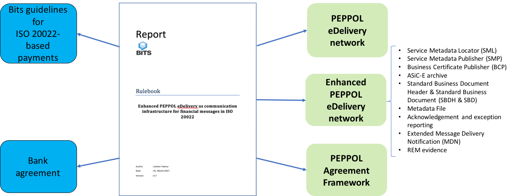

Although this rulebook is aimed at the Norwegian market, it is expected that the technical rules, principles and requirements expressed could be applied also in other markets and application domains. The actual use and content of the ISO 20022-based financial messages will however be constrained to the Norwegian market.

== Binding nature of the Rulebook

The rules, principles and guidelines identified and described in this document are considered as binding for:

* Service providers, i.e. ERP and AP providers, whose solutions and services have been accredited as compliant, and
* banks and their customers registered as receivers of ISO 20022-based messages in a Peppol SMP or acting as sender of such messages.

Any party claiming compliance to the rules, principles and requirements identified and described in this document may implement additional features in their solutions provided that these additional features do not violate or contradict the rules, principles and requirements described.

= Scope

== Description of scope
The scope of this rulebook is to identify and describe relevant rules, principles and requirements for the use of the Enhanced Peppol eDelivery for transport of ISO 20022-based financial messages between the banks and their customers, including

* the services and service levels (SLA) to be provided by banks, customers and their service providers;
* the technical content of, and relationship between, services provided. The rulebook will however not in itself define the actual technical specifications other than by reference;
* the transport of ISO 20022-based financial messages between the banks and their customers, and will not cover transport of the messages between the banks (interbank);
* the existence of legally binding agreements between the actors and the principle content of such agreements, but will not provide the actual legal text of the agreements.

This does however not prevent all or parts of this document to be relevant also for other use cases, such as interbank communications.

The below figure serves to illustrate the scope of this document.

.Scope of the Rulebook
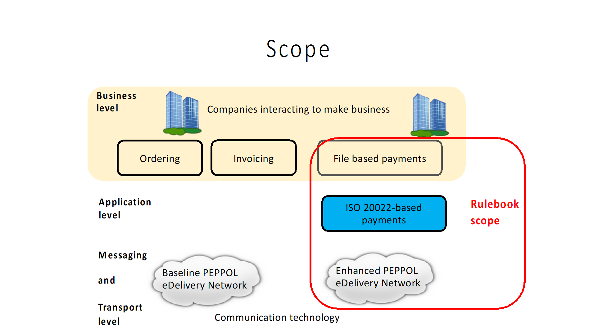

The *business level* is focused on the business agreement and use of file-based payment services (e.g. general payments, salary, etc.) between the customer and its bank. The business agreement should state that the parties will use Enhanced Peppol eDelivery, their responsibilities for connecting to an accredited Peppol Access Point as well as registration of the business documents they may receive in a Peppol SMP.

The *Application level* is focused on the use of ISO 20022-based financial messages, identification of the specifications relevant for the payment process (including what messages to use when, and how to handle errors and exceptions, the syntax to use and what information to place where in the files), identification of the requirements for securing the messages and service limitations (e.g. max. file size, timeouts, etc.) and the requirements for secured transfer of files between the bank, customer and their Peppol access points.

The *messaging and transport level* is focused on the agreements and technical specifications for how to interface and interact with the Enhanced Peppol eDelivery network as well as the services and service levels to be observed by the actors involved in this infrastructure.

== Prerequisites

The following principles are considered as prerequisites for this document:

* Each actor shall be free to choose an accredited service provider based on its own business requirements;
* All actors involved in the Enhanced Peppol eDelivery network shall ensure that their implementation complies to all relevant specifications and agreements and has sufficient capacity to meet expectations;
* The ISO 20022-based financial messages exchanged shall be compliant to the relevant Message Implementation Guidelines;
* The technical specifications applicable for the Enhanced Peppol eDelivery shall be fully conformant to the technical specifications maintained and approved by DFØ;
* The final set of agreements governing the use of the Enhanced Peppol eDelivery solution for transport of ISO 20022-based financial messages shall be positioned as an Application Domain Agreement and be in conformance to the results from the on-going revision of the OpenPeppol Transport Infrastructure Agreement.

= The business level

From a business level view point, the actors involved in the exchange of ISO 20022-based financial messages are the banks and their customers. Depending on the side of a financial transactions, these actors may take different roles as illustrated in Figure 2.

.The business level four-corner model.
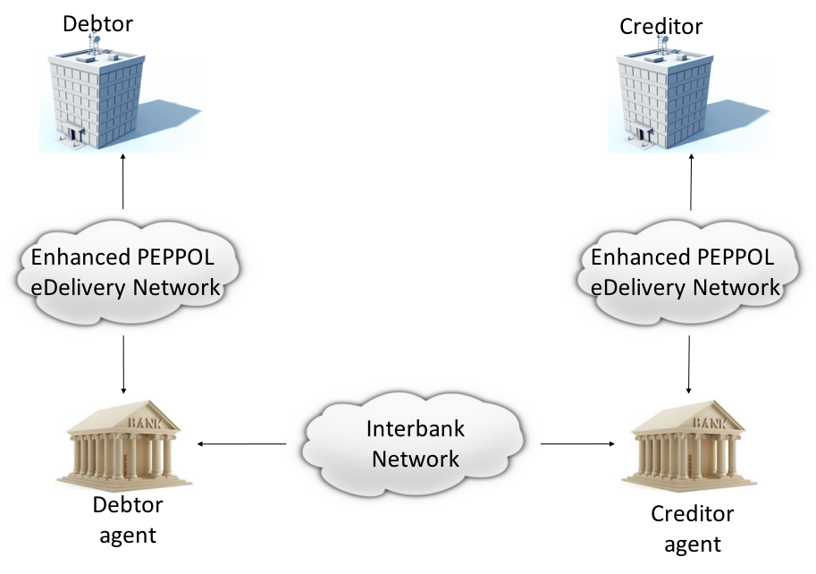

At the business domain level the following business roles are involved:

[cols="1,4", options=header]
|===
| Role
| Business function

h| Debtor
| A private or public entity who initiates a payment transactions to debit its account.
Party that owes an amount of money to the (ultimate) creditor. In the context of the payment model, the debtor is also the debit account owner. link:#ref-14[[14\]]

h| Debtor agent
| A bank or agent providing payment services for the debtor.
Financial institution servicing an account for the debtor. link:#ref-14[[14\]]

h| Creditor agent
| A bank or agent providing payment services for the creditor.
Financial institution servicing an account for the creditor. link:#ref-14[[14\]]

h| Creditor
| A private or public entity who is the receiver of funds following a payment transactions.
Party to which an amount of money is due. In the context of the payment model, the creditor is also the credit account owner. link:#ref-14[[14\]]
|===

== The role of an ERP solution provider

The payment services used by a debtor or the reconciliation services used by a creditor are typically provided by an ERP solution provider. Either by providing the basic ERP and payment/reconciliation functionality for installation on the debtor/creditor own hardware or by offering this functionality as a cloud service.

In any case the ERP solution provider is in no way involved in the business transactions and has no direct responsibility for the actual business content of the ISO 20022-based messages being exchanged.

It is the responsibility of the debtor/creditor to ensure that the payment/reconciliation services it applies comply to the rules, principles and requirements as stated in this document as well as any applicable legal requirements.

IMPORTANT: The ERP solution provider may have a written statement of conformance to applicable rules and specifications outlined in this rulebook.

== The role of a shared service centre
Especially in larger organisations the use of a shared service centre is becoming increasingly common. A shared service centre may handle payments on behalf of several legal entities. A shared service centre will typically operate the actual payment/reconciliation services and as such handle the data on behalf of their clients.

It is the responsibility of the debtor/creditor to ensure that any entity acting on its behalf comply to the rules, principles and requirements as stated in this document as well as any applicable legal requirements.

IMPORTANT: The shared service centre may have a written statement of conformance to applicable rules and specifications outlined in this rulebook.

== The role of a banks service provider

The banks will also frequently make use of third party service provider to do parts of the processing. Such third-party service provider is in no way involved in the business transactions and has no direct responsibility for the actual business content of the ISO 20022-based messages being exchanged.

It is the responsibility of the bank to ensure that the services it applies comply to the rules, principles and requirements as stated in this document as well as any applicable legal requirements.

= The application level

The actors and roles involved at the application level are the same as those at the business level as illustrated in Figure 2 above. These roles will exchange ISO 20022-based financial messages as identified in the below table defined in link:#ref-12[[12\]] depending on the business scenario implemented as the agreement between the bank and its customers.

The relevant business scenarios supported are:

[cols="1,4", options="header"]
|===
| Process
| Business scenario

h| Scenario 1: +
General credit transfer initiation
| Following the approval of a received claim for payment (e.g. an invoice), the Debtor will initiate a credit transfer to the Creditors account and be advised on the debits made as basis for reconciliation of Accounts Payable.

h| Scenario 2: +
Cancelation of general credit transfer Initiation
| The Debtor may request that previous payment initiations not yet processed, can be cancelled.

h| Scenario 3: +
Salary payment
| Following the approval of salary payments and other compensations in an HR-system, the Debtor will initiate a credit transfer and be advised on the debits made as basis for reconciliation of Accounts Payable.

h| Scenario 4: +
Salary payments cancellation
| The Debtor may request that a previous salary payment initiations not yet processed, to be cancelled.

h| Scenario 5: +
Billing
| Customer processes invoices (paper based or electronic), and forwards to customer. Bank returns notification file for automated reconciliation of account receivable

h| Scenario 6: +
Billing system with direct debit
| Based on an established mandate, the Creditor will do a direct debit on the Debtor’s account and be advised on credits received as basis for reconciliation of Accounts Receivables.

h| Scenario 7: +
Cancellation of direct debit initiation
| The Creditor may request that previous direct debit initiations not yet processed, can be canceled

h| Scenario 8: +
Mandate administration
| Based on an agreement between the Creditor and Debtor, the Creditor will establish a direct debit mandate with the banks to authorise the use of direct debit.

h| Scenario 9: +
Accounting/General Ledger/cash management
| The Debtor/Creditor will receive a periodic notification from its agent about debits/credits made to its account for reconciliation of general ledger and decision-/liquidity-systems.

h| Scenario 10: +
Account statement
| The Debtor/Creditor will receive a periodic statement from its agent about transactions made to its account for reconciliation of general ledger and decision-/liquidity-systems.

h| Scenario 11: +
Account report
| The Debtor/Creditor will receive a periodic report from its agent about transactions made on its account for reconciliation of general ledger and decision-/liquidity-systems.
|===

To support the implementation of these business scenarios in the Enhanced Peppol eDelivery network, a set of unique process and document identifiers has been developed and are available from link:ref-20[[20\]].

= The messaging and transport domain

The Peppol eDelivery network is a combination of a four-corner message exchange model, discovery model (capability look-up), a PKI-based security model and a legal framework that enables the exchange of structured information through the internet, wrapped in a messaging envelope.

The Peppol eDelivery network, as currently used for e.g. electronic invoicing, was established to ensure secure and reliable messaging between Peppol Access Point services. To provide support for end-to-end security and reliable messaging required for the exchange of financial messages, as well as for electronic communication by the public procurement directives, an enhanced version of the Peppol eDelivery network has been established.

In the four-corner model, the back-end systems of end-users do not exchange data directly with each other, but transport data through Access Points. These Access Points (Peppol AP) are conformant to the same technical specifications and are therefore capable of communicating with each other.

From a transport domain viewpoint, the actors involved in the exchange of ISO 20022-based financial messages are the sender and receiver of an ISO 20022-based financial message and their respective Peppol AP Providers as illustrated in Figure 3.

.The messaging and transport level four-corner model.
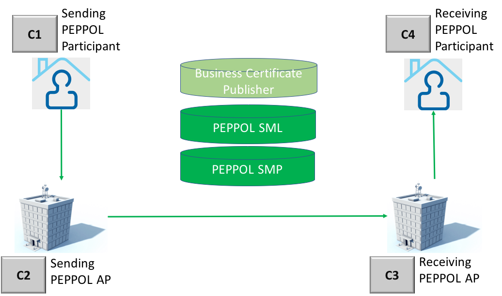

At the messaging and transport level the following roles are involved:

[cols="1,4", options="header"]
|===
| Role
| Function

h| Peppol Participant
| A private or public entity using the Enhanced Peppol eDelivery network to send or receive Business Documents (i.e. an ISO 20022-based financial message).

A Peppol Participant can act in any of the business roles identified in point 4 above.

h| Peppol AP Provider
| An organization providing Peppol Access Point services as part of the Peppol Transport Infrastructure and thereby giving a Peppol Participant access to the Peppol eDelivery network.

(Further rules and guidance on how to become a Peppol AP provider is given in link:#ref-5[[5\]] and link:#ref-6[[6\]]. An open source implementation of a Peppol AP service is given in link:#ref-7[[7\]].)

h| Peppol SMP
| The Peppol SMP service is a repository of information about Peppol Participants and their capabilities to receive ISO 20022-based financial messages, as well as the Peppol AP Provider used.

// ELMA is the centralised SMP service used In the Norwegian market provided by DirDir.

h| Peppol SML
| The Peppol SML service is a centralised component of the Peppol eDelivery network functioning as a registry of Peppol Participants and the SMP in which further information may be found.

// The Peppol SML is provided under contract by the EC unit DG DIGIT.

h| CertPub Publisher
| The CertPub Publisher is a component introduced to store and make available qualified certificate upon lookup.

h| CertPub Locator
| The CertPub Locator is a centralised component functioning as a registry of Peppol Participants and the CertPub Publisher in which further information may be found.
|===

== The role of the Peppol SMP

Each Peppol Participant using the Enhanced Peppol eDelivery network need to be registered in a Peppol SMPfootnote:[The Peppol SMP service used in the Norwegian market is known as ELMA.]. The Peppol SMP is a service, or a repository, containing information about the identity of the Peppol Participant (the Peppol Participant ID), the type of financial messages it can receive (receive capabilities) and the Peppol AP to which the messages should be delivered.

The actual registration in the SMP will be done by the Peppol AP Provider.

IMPORTANT: The Peppol AP Provider shall register receive capabilities in an SMP for all Peppol Participants it services.

As there is a close relationship and dependency in the use of ISO 20022-based financial messages in the different business processes as described in section 5 above, the SMP provider need to ensure that the Peppol Participants are registered with a formally issued Peppol Participant ID and a correct and consistent set of receive capabilities.

IMPORTANT: The provider of Peppol SMP services for ISO 20022-based financial messages shall have procedures in place to ensure that Peppol Participants are identified by an identifier that enables verification of the Peppol Participant as a legally established entity.footnote:[Within the Norwegian SMP, ELMA, the legal company identifier (“organisasjonsnummer”) will be used as Peppol Participant identifier.]

IMPORTANT: The provider of Peppol SMP services for ISO 20022-based financial messages shall have functionality implemented to ensure that Peppol Participants are registered with a correct and consistent set of receive capabilities as per link:#ref-20[[20\]].

== The role of a Peppol AP Provider

A Peppol Participant, i.e. a sender or receiver of ISO 20022-based financial messages, will utilise a Peppol AP service to gain access to the Enhanced Peppol eDelivery Network. The provider of such services, the Peppol AP Provider, can be compared to the mailman in a traditional physical mail system. Analogue to this it follows that the Peppol AP Provider does not have any responsibility for the content inside of the envelope being handled. Due to the introduction of end-to-end security in the Enhanced Peppol eDelivery network, the Peppol AP Provider is not even capable of reading or processing the payload within the envelope.

On the other hand, there is a requirement on the Peppol AP Providers participating in the Enhanced Peppol eDelivery network to offer services and service levels conformant to the stated requirements in link:#ref-16[[16\]]. This include a requirement on the Peppol AP provider to maintain an internal register of addresses suitable for routing of received messages and acknowledgements to the correct Debtor/Creditor.

IMPORTANT: A Peppol AP Provider offering services in the Enhanced Peppol eDelivery network shall have its services accredited as conformant to the SLA requirements for providers of Peppol Access Points services in the Enhanced Peppol eDelivery network link:#ref-16[[16\]].

== The role of the CertPub services

The role of the CertPub services link:#ref-25[[25\]] is to store and make available qualified certificate upon lookup for a receiver who wishes to receive encrypted documents. This makes it possible to introduce end-to-end security. The service can retrieve qualified certificates when a valid combination of participant identifier and business process identifier are used for the lookup. Business processes are used to separate areas like payments and invoicing.

The CertPub services thus fulfils the role as a qualified certificate publisher for secure messaging.

IMPORTANT: The provider of CertPub services for ISO 20022-based financial messages shall have procedures in place to ensure that Peppol Participants are identified by an identifier that enables verification of the Peppol Participant as a legally established entity.footnote:[Within the Norwegian SMP, ELMA, the legal company identifier (“organisasjonsnummer”) will be used as Peppol Participant identifier.]

IMPORTANT: The provider of CertPub services for ISO 20022-based financial messages shall have procedures in place to ensure that only certificates issued by a qualified certificate issuer are used.

CertPub is realized as a distributed component in the enhanced Peppol eDelivery network, where Peppol Participants will have access to store their qualified certificates used within a business process.

= Key security, packaging and routing requirements

== Business level security

A key aspect of business level security is to ensure that an individual or legal entity is authorized to execute a given operation, such as debiting an account for a certain amount.

Such verification is typically done through

* the use of a two-step approval process where the payment transaction is finally approved in the internet banking system. In this case the authorization is done in the internet banking system.
* or by use of bank certificates issued by or on behalf of the bank. In this case the payment transaction is signed with the bank certificate and this signature is forwarder to the bank together with the payment transaction itself to achieve straight through processing.

== Secure message exchange

A feasibility study issued by the Norwegian banks identifies the basic requirements for secure and reliable exchange of financial messages between banks and their customers. Besides the traditional key elements of secure and reliable messaging discussed in the sub-sections below, the reports emphasise the need to establish a qualified certificate provider to facilitate security in an environment where the sender and receiver are more or less unknown for each other. These basic requirements have been further elaborated in link:#ref-13[[13\]] which defines the minimum security requirements for data transport in the financial industry. This specification defines requirements related to key security aspects such as:

* Confidentiality;
* Authentication;
* Integrity;
* Non-repudiation of origin and receipt; and
* The use of trust anchor.

The document defines requirements to be observed by all actors involved in the process.

IMPORTANT: Peppol Participants and Peppol AP Providers shall ensure that the services they implement and operate are in conformance to the security requirements defined in link:#ref-13[[13\]].

IMPORTANT: The provider of the CertPub Publisher service shall ensure that the services they implement and operate are in conformance to the security requirements defined in link:#ref-13[[13\]].

== Validation of business transactions

Validation is used to ensure that the content of a message is technically correct and complies to its governing specification(s). This is typically done by validating an XML instance document against its governing XML Schema and/or by running a set of schematron rules to validate the actual content.

IMPORTANT: The Peppol Participant acting in the role as sender of an ISO 20022-based financial messages shall ensure that the content of the ISO 20022-based financial message is compliant to the appropriate specification in link:#ref-12[[12\]].

IMPORTANT: The Peppol Participant acting in the role as receiver of an ISO 20022-based financial messages may validate that the content of the ISO 20022-based financial message is compliant to the appropriate specification in link:#ref-12[[12\]].

IMPORTANT: If the receiver of an ISO 20022-based financial messages detects errors during validation or processing it shall advise the sender accordingly by return of an error message as specified in link:#ref-12[[12\]].

IMPORTANT: The sending Peppol AP provider offering services in the Enhanced Peppol eDelivery network shall ensure that the file sent is compliant to all appropriate specification for the Enhanced Peppol eDelivery network.

== Packaging

Before sending an ISO 20022-based financial message, the XML-file need to be prepared and packaged into an appropriate envelope format.

IMPORTANT: The sender of an ISO 20022-based financial messages shall ensure that the message is packaged for transmission in compliance to link:#ref-17[[17\]].

== Addressing

To facilitate routing of the envelope between Peppol APs, even after its content is encrypted, there is also a need to carry the basic addressing information and information on the type of data carried in the envelope outside of the actual financial message itself. This is typically done using some form of a header that carries data about the business transaction carried in the envelope.

IMPORTANT: The sender of an ISO 20022-based financial messages shall ensure that the required addressing information is available in compliance to link:#ref-11[[11\]].

== Processing metadata

To facilitate internal routing and correct processing of the business transaction by the receiver, there is also a need to carry some metadata about the customer relationship between the bank and its customer outside of the actual ISO 20022-based financial message.

IMPORTANT: The sender of an ISO 20022-based financial messages shall ensure that the required metadata-file is available in compliance to link:#ref-21[[21\]].

== Audit trail and evidence

An audit trail is a chronological record, or set of records, that provide documentary evidence of the sequence of activities that have affected a message. In a process involving several actors and roles, an audit trail can be established by collecting acknowledgements generated at different steps in the process.

IMPORTANT: Peppol AP Providers offering services in the Enhanced Peppol eDelivery network shall log all Peppol Business Documents/payloads that they send or receive.

IMPORTANT: Peppol AP Providers offering services in the Enhanced Peppol eDelivery network shall implement procedures to follow-up and initiate investigation if acknowledgments are not received.

IMPORTANT: In case of non-delivery, the Peppol AP Provider shall inform the Peppol Participant. The Peppol AP Provider shall not do a re-send of messages.

In addition to the logging, which primarily is done for operational purposes, the actors are required to generate and store secure evidence of the documents exchanged.

IMPORTANT: Peppol AP Providers offering services in the Enhanced Peppol eDelivery network shall generate and store REM evidence in compliance to link:#ref-18[[18\]] for the Peppol Business Documents/payloads they handle.

= Enhanced Peppol eDelivery

== Peppol eDelivery vs. Enhanced Peppol eDelivery

=== Peppol eDelivery

The Peppol eDelivery network as currently used for e.g. electronic invoicing, is a profile of the European Commission Connecting Europe Facility (CEF) eDelivery Digital Service Infrastructure (DSI), or a Peppol eDelivery for short.

.Peppol eDelivery
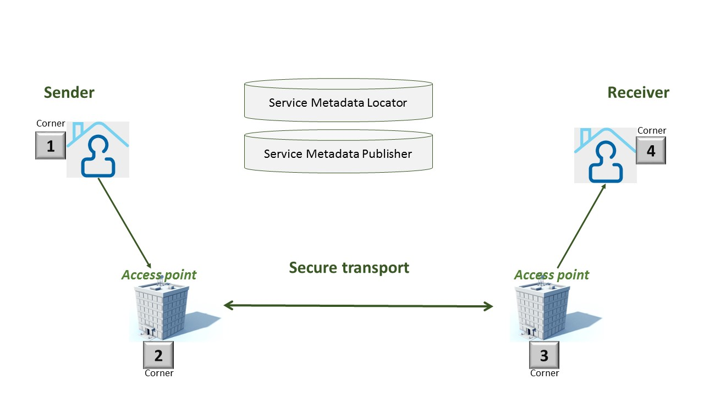

=== The Enhanced Peppol eDelivery network

To provide support for end-to-end security and reliable messaging, as well as increased service levels, required for electronic communication by the public procurement directives, an enhanced version of the Peppol eDelivery network has been established.

The specifications for this enhanced version of the Peppol eDelivery network were developed and tested as part of the e-SENS project as well as by DFØ, and are expected to become a part of the Peppol eDelivery network specifications.

The main features of the Enhanced Peppol eDelivery network is that it supports a higher level of security, including encryption of documents and the ability to track and trace all messages sent throughout the network.

.Enhanced Peppol eDelivery
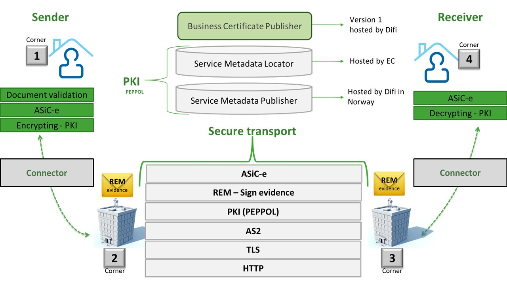

== Building blocks of the Enhanced Peppol eDelivery network

The Enhanced Peppol eDelivery network is built by combining a set of standardised building blocks, some of which are available as open source software. A short description of the different components (building blocks) of the Enhanced eDelivery network is given in the following sub-sections.

=== Service Metadata Locator (SML)

The SML is a standard component of the well-established Peppol eDelivery network link:#ref-9[[9\]], whose role is to manage the resource records of the participants and the SMPs (Service Metadata Publishers) in the DNS (Domain Name System).

The SML is the only centralised component in the Peppol eDelivery network.
// , and is currently operated by the EC unit DG DIGIT.

The Enhanced Peppol eDelivery network implies no changes to the Peppol SML service.

=== Service Metadata Publisher (SMP)

The SMP is a standard component of the well-established Peppol eDelivery network link:#ref-10[[10\]], whose role is to provide information about the receive capabilities of the Peppol Participants and the Peppol APs they use.

The SMP is a distributed component in the Peppol eDelivery network.

The key information elements exposed by the Peppol SMP for each Peppol Participant are:

* The Peppol Participant ID (PPID) used to identify the Peppol Participant in the eDelivery networkfootnote:[In the Norwegian market the “organisasjonsnummer” (Norwegian legal identity number) is used for this purpose.]
* The business process and type of business documents the Peppol Participant can receive
* The Peppol AP to which the business document shall be delivered

. Key information elements exposed by ELMA.
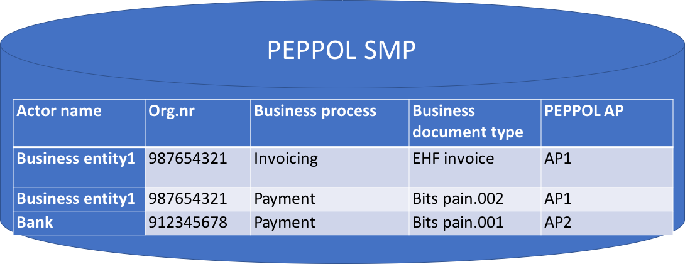

=== CertPub Publisher (formerly Business Certificate Publisher (BCP))

The CertPub Publisher link:#ref-25[[25\]] is a new component introduced with the Enhanced Peppol eDelivery Network.

The role of the CertPub Publisher (Certificate server) is to store the public key of a the encryption certificate for a receiver who wishes to receive encrypted documents. This makes it possible to introduce end-to-end security. The service offers retrieval of the public key when a valid combination of participant identifiers and business process are used for the lookup.

The key information elements exposed by the CertPub Publisher for each Peppol Participant in the Enhanced Peppol eDelivery network are:

* The Peppol Participant ID used to identify the Peppol Participant in the eDelivery network
* The business process for which a given business certificate is used
* The applicable encryption certificate

.Key information elements exposed by the CertPub Publisher.

=== CertPub Locator

The CertPub Locator link:#ref-25[[25\]] is a new component introduced with the Enhanced Peppol eDelivery Network.

CertPub Locator is heavily influenced by Peppol SML. The main difference is use of REST where Peppol SML uses DNS.

The role of the CertPub Locator is to discover the CertPub Publisher used by a given Peppol Participant.

=== ASiC-E archive

The ASiC-E (Associated Signature Containers – Extended) is a new component introduced with the Enhanced Peppol eDelivery network.

ASiC-E is a file format to package data of various types into a zip-folder (the ASiC-E archive). Each ASiC-E archive can have payload (e.g. an ISO 20022-based financial message), additional information or metadata associated with it that can be protected by a signature.

The profile of ASiC-E as implemented in the Enhanced Peppol eDelivery network is defined in the technical specification provided by the e-Sense project link:#ref-17[[17\]].

In the Enhanced Peppol eDelivery network two instances of ASiC-E are used. The inner ASiC-E archive contains the actual business documentfootnote:[In case of straight through processing the Inner ASiC-E archive will also carry the signature generated by applying the Bank certificate.] and its associated metadata file, e.g. a pain.001- message and the metadata file placed in the root folder and the electronic seal of the sender is placed in the META-INF folder to prove integrity.

.Content of inner ASiC-E archive.
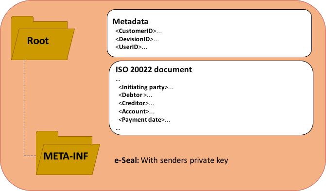

The outer ASiC-E archive contains the encrypted version of the inner ASiC.

.Content of outer ASiC-E archive.
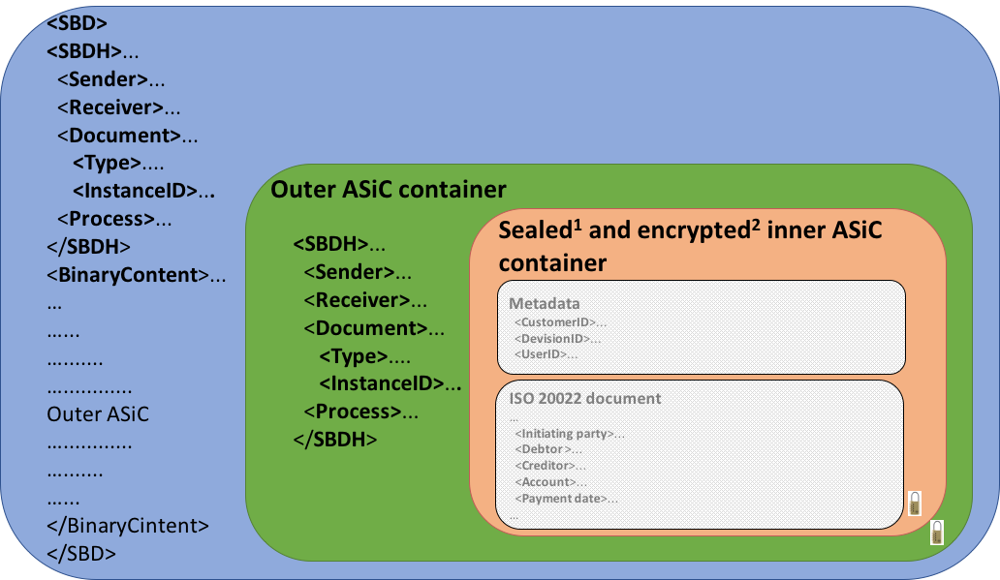

The purpose of using the two ASiC containers is to exploit the rate of compression of the payload and attachments in an ASiC-E archive. Encrypting documents before compression will result in the compression rate to be much lower.

For encryption of the actual ISO 20022-based financial message the hybrid encryption approach is applied as outlined in link:#ref-3[[3\]] using the encryption certificate assigned to the sending Peppol Participant.

=== SBDH and SBD

The Standard Business Document (SBD) and Standard Business Document Header (SBDH) are standard component of the well-established Peppol eDelivery network link:#ref-11[[11\]].

The function of the SBD is to provide an envelope around the data to be transported over the Peppol eDelivery network. The function of the SBDH is to carry routing information about the actual business document contained in the transmission.

Information in the SBD and SBDH can be categorized into the following 4 categories:

* Document Routing
* Document Identification
* Document Processing Context
* Payload

Document Routing information is captured in the 'Sender' and 'Receiver' data structures of the SBD/SBDH and it is used to identify the Peppol Participant acting in the roles as sender and receiver using PPID as unique identifiers.

Document Identification information is captured in the 'DocumentIdentification' data structure of the SBD/SBDH. It is used to identify the specification to which the actual business document content enclosed inside the SBD complies. This information may be used by the sender and recipient to identify and route the message to the appropriate business application without having to open the business document payload.

Document Processing Context is captured in the 'BusinessScope' data structure of the SBD/SBDH. It is used to provide parameters for processing the business document in the context of a business process supported.

The payload represents the actual business document, or more precisely the outer ASiC container in the Enhanced PEPPOL eDelivery network.

=== Metadata file

The metadata file is a new component introduced with the Enhanced Peppol eDelivery network.

The function of the metadata file is to carry additional information about the message carried in the payload to facilitate correct internal routing and processing by the receiving Peppol Participants.

The actual content values to be included in the metadata file will be governed by the agreement between the business partners. The default setup is that the metadata attributes are not in use. Meaning that a business partner can only be expected to act based on the content of any metadata attribute, if this has been agreed between the two business partners.

The metadata file may include the following information elements:

[cols="1,5,4", options="header"]
|===
| Element
| Business content
| Representation

| Customer ID
| An identifier of the sender (corner 1) of the Enhanced Peppol transmission. Typically, an identifier issued by the receiver, for instance a customer id.
| Alphanumeric 22 characters

| Division
| Division or subset for separating different file type. **Deprecated**
| Numeric 3 characters

| User ID
| An identifier of the message originator or the party approving the message content. This could be an account owner or a power of attorney. Especially when the message originator is different from the party operating Corner 1.
| Alphanumeric 22 characters
|===

=== Acknowledgments and exception reporting

The Enhanced Peppol eDelivery network introduces some enhanced and new requirements for the use of acknowledgments and exception reporting to support the requirements for reliability and full traceability of the message exchange.

As responsibility for processing is transferred from one role to another, the actor performing a given role is required to generate and forward an acknowledgment to the preceding role as illustrated in Figure 10.

.Use of confirmation message (RC4) and exception report (RC4b).
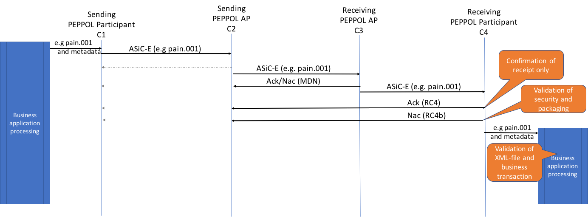

The receiving Peppol AP will generate and return an MDN (Message Delivery Notification) to the sending Peppol AP.

The receiving Peppol Participant will generate and return an confirmation message (known as RC4 link:#ref-22[[22\]]) to confirm that the transmission is received before starting un-packing and processing of the ASiC-E archive.

If any exceptions are detected during the un-packaging and processing of the ASiC-E archive, such as errors related to signature validation or decryption, an exception report (known as RC4b link:#ref-23[[23\]]) is created and returned to the Sending Peppol Participant.

The Reception Acknowledgment Message link:#ref-22[[22\]] and Handling Exception Message link:#ref-23[[23\]] are new components introduced with the Enhanced Peppol eDelivery network. Due to network configuration and priorities, the sending Peppol Participant may in some cases receive an RC4b (exception report) before the corresponding RC4 (acknowledgment). The sequence in which these two messages are received shall not be considered significant.

There is a requirement on the Peppol AP providers offering services in the Enhanced Peppol eDelivery network to make all received acknowledgments and exception reports available to the Peppol Participant. The actual content and structure of how this is done is however left for the Peppol AP provider and Peppol Participant to agree.

Even though there are obligations on each actor to follow-up and initiate investigation if acknowledgments or exception reports are not received, it is the ultimately the Sending Peppol Participant who shall ensure that appropriate responses ate received.

=== MDN

The MDN is a standard component of the well-established Peppol eDelivery network link:#ref-9[[9\]] used to provide an acknowledgment on messages exchanged between Peppol APs.

To meet the increased requirements for security and trust required for exchange of financial messages, an enhanced version of the MDN will be used in the Enhanced Peppol eDelivery network.

This enhanced version of the MDN implements two key features:

* Use of SHA-512 for creation of MIC of both transmission and response according to RFC3851 point 3.4.3.2.
* Added MDN field “Date” defined by IANA using formatting according to RFC822 point 5 as described in RFC3798 point 3.3.

=== REM evidences

As the exchange of financial messages requires secure evidence of the message exchange, the Enhanced Peppol eDelivery network uses a part of REM (Registered Electronic Mail) standardized by ETSI.

REM evidence link:#ref-18[[18\]] is a new component introduced with the Enhanced Peppol eDelivery network to provide for non-repudiation, where the MDN (Message Disposition Notification) is put into the REM evidence by the Peppol AP provider. The REM evidence is then signed and stored by the Peppol AP provider

== Use of building blocks in the Enhanced Peppol eDelivery network

By combining the building blocks described above, secure end-to-end messaging is achieved. A short description of the process of combining the components is given below. The technical details of this process may also be found at link:#ref-24[[24\]].

The typical process steps involved are:

Sending Peppol Participant::
. Create the ISO 20022-based financial message
. Create the metadata file associated to the ISO 20022-based financial message
. Create the inner ASiC-E archive
. Create the SBDH in outer ASiC
. Create the outer ASiC-E archive
. Create the outer SBD
Sending Peppol AP::
[start=7]
.	Add transport oriented packaging and security to ensure integrity and confidentiality at transport level between Peppol APs
Receiving Peppol AP
. Verify transport oriented packaging and security
. Acknowledge receipt
. Create and store REM evidence
Receiving Peppol Participant::
[start=11]
.	Create reception acknowledgement message
.	Verify packaging and potentially create exception handling message
.	Process the ISO 20022-based financial message

=== Signing, sealing and encryption

Figure 10 below illustrates how the results of the different certificates are carried in the ASiC-E archives.

.Use of signing, sealing and encryption certificates
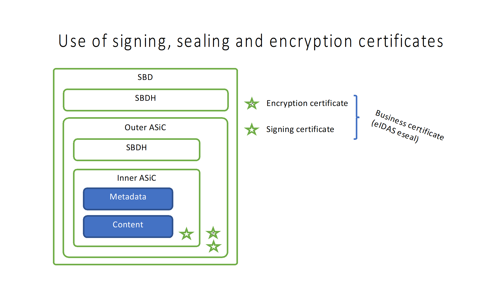

Banks may issue business level certificates (Bank Certificates) to their customers (account owners). The purpose of signatures by Bank Certificates is to authenticate the business transition in case of straight through processing. The customers or their representatives signs the content of ISO 20022 based messages with those certificates.  The signatures should be validated by the application processing the ISO 20022 based message. 

The inner ASiC-E archive may carry one or more signatures resulting from applying Bank Certificates to the content of the ISO 20022-based financial message. Those signatures shall be seen as additional content-files and be signed using the business certificate.

The business certificates are issued by Trust Service Providers approved by CerPub. The signatures based on those certificates are used for authenticating the sender (Corner 1) and ensure the integrity of the messages between Corner 1 and Corner 4.

The inner ASiC-E archive shall carry the electronic seal generated by applying the business signing certificate issued to the sending Peppol Participant on the ISO 20022-based financial message.
The following illustration shows an ASiC with a business signature (in blue) and a bank certificate based signature (in red).

.Business and Bank certificate signatures in ASiC
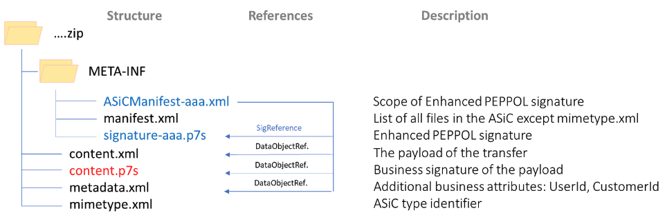

== Open source components

The components (building blocks) of the Enhanced eDelivery network are implemented as open source components or made available as part of commercially available software products.

The most significant open source components available to realise the functions needed for a sending or receiving Peppol Participant or Peppol AP Provider are described in the following sub-sections.

=== Oxalis

Oxalis is an open source implementation of a Peppol access point according to the specifications used by OpenPeppol. The project focuses on handling of messages in a secure manner. The project itself contains only those interfaces required by the specifications and interfaces needed to extend existing solutions with Peppol transmission capabilities or to create new services part of Peppol network. The project is written in Java.

As from version 4.0 Oxalis provides full support for the Enhanced Peppol eDelivery network.

=== VEFA Peppol

VEFA Peppol is an open source project implementing support for several of the building blocks used in the Enhanced Peppol eDelivery network, such as:

* REM evidence
* ICD
* Look-up (i.e. an SML/SMP-client)
* An SMP-Interface (SMP-server)
* SBDH
* Peppol-PKI

This project may be utilized for one or more of the above building blocks. For instance, an implementation may use this project to implement generation of the SBDH.

= Contractual relationships

The figure below gives an over view of the contractual relationships assumed to be present between the different actors/roles.

.Contractual relationships between roles.
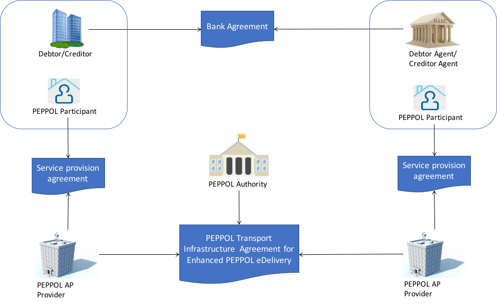

== Bank agreement

In the role as Debtor/Creditor a business entity will have an agreement with its bank acting in the role as Debtor/Creditor Agent.

The bank agreement will provide governance for the business relationship between the two actors, including provisions for the actual use of the relevant ISO 20022-based messages.

IMPORTANT: The customer shall have a signed contract with its bank regarding the use of file based payments services.

== Service provision agreement

In the role as Peppol Participant the business entity, as well as the bank, will have an agreement with a Peppol AP Provider. The business entity and the bank may make use of the same or different Peppol AP Providers.

IMPORTANT: A Peppol Participant shall have a signed contract with its Peppol AP Provider.

This service provision agreement will govern the details related to the services offered by the Peppol AP Provider and how the Peppol AP service is connected to the internal ICT infrastructure of the Peppol Participant. The detailed content of this agreement is left for the parties to define.

== The Peppol Agreement Framework for Enhanced Peppol eDelivery

The Peppol Agreement Framework for Enhanced Peppol eDelivery is a multilateral agreement between Peppol AP Providers for provision of Enhanced Peppol eDelivery services. The purpose of this agreement is secure a minimum set of common services and service levels.

The Peppol Agreement Framework for Enhanced Peppol eDelivery is built up of the following elements:

* The *Peppol Authority Agreement* which gives a Peppol Authority responsibility for the implementation and use of the Enhanced Peppol eDelivery network within its geographical or industrial juristictionfootnote:[DFØ acts as a Peppol Authority within the country of Norway, and has furthermore been assigned as Peppol Authority for the payment business domain.] domain;
* The *Peppol eDelivery Agreement* which authorises the Peppol AP Provider to provide Peppol AP services in the Enhanced Peppol eDelivery network;

IMPORTANT: A Peppol AP Provider offering services for transport of ISO 20022-based financial messages in the Enhanced Peppol eDelivery network shall have a Peppol eDelivery Agreement  signed with the appropriate Peppol Authorityfootnote:[DFØ acts as a Peppol Authority within the country of Norway, and has furthermore been assigned as Peppol Authority for the payment business domain.].

IMPORTANT: The Peppol AP shall be verified and certified as conferment to the specifications of the Enhanced Peppol eDelivery network by the Peppol Authority with whom the service provider has an agreement before they will be enrolled with a production certificate

= Use cases

In real life, there may be a range of combination of actors involved in the handling of financial messages.
As an example, the business entity initiating a payment transaction may operate all functions internally, i.e.

* have its own internal accounting staff operating,
* its own installation of an ERP solution, and
* operating its own Peppol AP service connected to the Enhanced Peppol eDelivery network.

In such a scenario, there is a very clear and direct line of communication between the business entity and his bank where the business entity has full operational control for all aspects of the process.

On the other extreme: a business entity may

* use a Shared Service Centre offered by an external third party,
* who is using an ERP solution hosted by another third party,
* who is connected to a commercial Peppol AP Provider offered by yet another organisation.

Even in this most complex scenario, it is the Peppol Participant identified as the sender or receiver of a message that is ultimately responsible for the complete process. As a matter of principle, the internal complexity of how the IT infrastructure is organised should not be of concern to other actors. The Shared Service Centre, ERP solution provider and Peppol AP Provider are all acting on behalf of the Peppol Participant.

.Service providers acting on behalf of the Peppol Participant.
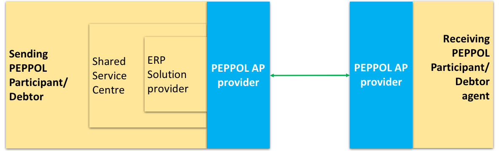

IMPORTANT: A Peppol Participant shall ensure that signed contracts exist for all third-party services provided on its behalf.

IMPORTANT: A Peppol Participant shall ensure that service providers acting on its behalf has access to sufficient information (e.g. internal routing information and certificates) allowing them to fulfil their obligations as expected.

== Transfer of legal responsibility

As is noted above, it is the Peppol Participant identified as the sender or receiver of a message that is ultimately responsible for the complete process. This implies that the legal responsibility is transferred somewhere between the sender and receiver. A term frequently used in legislation is “come to the knowledge of”, which in general terms can be interpreted as “the receiver of some information is bound by that information as soon as it enters its domain of responsibility”. Based on this understanding the European Commission has provided a ruling stating that “an electronic message is received as soon as the last byte is received by the recipient’s access point”.

It follows from this that the Peppol Participant has responsibility for all service providers acting on its behalf.

IMPORTANT: A Peppol Participant shall ensure secure and reliable processing of information within its domain of responsibility.

.Transfer of legal responsibility.
image::images/legal-responsibility.png[]

[appendix]
= Common use cases

The following sub-sections describes some common use-cases and how they affect the distribution of roles between the actors involved.

== Using an internal accounting function

In this use case a business entity is using an internal accounting function/department to process its accounting, including all its payments.

The business entity has a business agreement with its bank for use of ISO 20022-based financial messages for straight through processing. It also has an agreement with a Peppol AP provider (AP1) giving access to the Enhanced Peppol eDelivery network.

The registrations needed in a Peppol SMP and the CertPub Publisher to support this use case are:

[cols="1,1,1,1,1", options="header"]
.Registration in ELMA for the “Using an internal accounting function” use case.
|===
| Actor name
| PPID
| Business process
| Business document type
| Peppol AP

| Business entity
| 987654321
| Invoicing
| EHF invoice
| AP1

| Business entity
| 987654321
| Payment
| Bits pain.002
| AP1

| Bank
| 912345678
| Payment
| Bits pain.001
| AP2
|===

[cols="1,1,1,2"]
.Registration in CertPub Publisher for the “Using an internal accounting function” use case.
|===
| Actor name
| PPID
| Business process
| Business certificate

| Business entity
| 987654321
| Secure invoice
| Qwertyuio….

| Business entity
| 987654321
| Payment
| Asdfghjk….

| Bank
| 912345678
| Payment
| Zxcvbnm,…..
|===

== Using an internal accounting function and two-level authorisation

In this use case a business entity is using an internal accounting function/department to process its accounting, including all its payments. The business entity is not aiming for straight through processing of payments, but employs a two-step approval process where the payment transaction is approved in the internet banking system.

Also in this case, the business entity need to have a business agreement with its bank for use of ISO 20022-based financial messages. The Bank Agreement also need to make it clear that final approval of the payment transaction takes place in the internet banking system.

The business entity will also have an agreement with a Peppol AP provider (AP1) giving access to the Enhanced Peppol eDelivery network.

The registrations needed in a Peppol SMP and a CertPub Publisher to support this use case are the same as for the previous use case.

== Use of a Shared Service Centre with delegated authority

In this use case a business entity is using a Shared Service Centre (SSC) to process its accounting, including all its payments, where the SSC is authorized to make payments on behalf of the Debtor.

The business entity has a Bank Agreement for use of ISO 20022-based financial messages for straight through processing authorising the SSC to debit its account. This implies that the SSC will be identified as an initiating party within the ISO 20022-based financial message.

In this use case, it is either the business entity or the SSC acting on behalf of the business entity who is identified as the Peppol Participant. Who is allocated the role as Peppol Participant depends on the agreement between the business entity and the bank.

== Use of a Shared Service Centre with two-level authorisation

In this use case a business entity is using a Shared Service Centre (SSC) to process its accounting, including all its payments, where the SSC is preparing the payment transactions but they are not authorized to make payments on behalf of the business entity. Instead a two-step approval process where the payment transaction is finally approved in the internet banking system is applied.

Also in this use case the business entity need to have a business agreement with its bank for use of ISO 20022-based financial messages. The Bank Agreement also need to make it clear that final approval of the payment transaction takes place in the internet banking system. As the SSC is preparing the actual ISO 20022-based financial message, the SSC will be identified as an initiating party.

Again, it is either the business entity or the SSC acting on behalf of the business entity who is identified as the Peppol Participant. Who is allocated the role as Peppol Participant depends on the agreement between the business entity and the bank.

[appendix]
= Examples of signatures and metadata

This appendix is available as a link:attachments/appendix-b-v1.0.pdf[separate file].