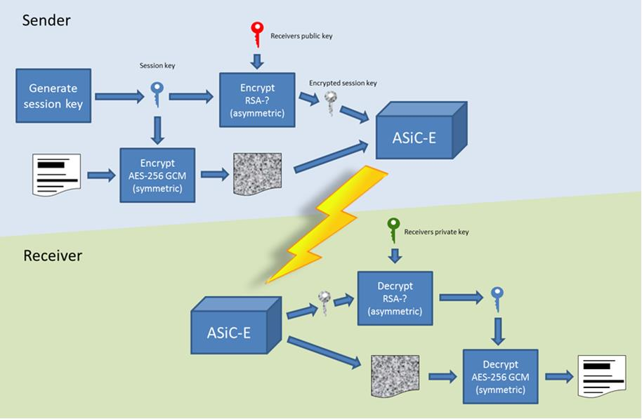

= Security requirements for secure file transactions
Bits AS
0.92 SNAPSHOT
:doctype: book
:icons: font
:toc: left
:toclevels: 2
:source-highlighter: coderay
:source-language: xml
:sectanchors:
:sectnums:

== Background

The Norwegian banks are in the process of implementing ISO 20022-based messages for handling of payments, such as payment instructions from customers or notifications sent to customers. This development implies an introduction of ISO 20022-based messages in the bank-customer interface and a gradual phase-out of the currently established formats. As part of this implementation there have also been a growing recognition for improvements to the communication infrastructures used. It is recognized that any future communication infrastructure used in the bank-customer interface need to build upon infrastructures and standards commonly accepted in the market and provide the technical and legal security required for this type of business transactions.

The PEPPOL eDelivery network is widely used for exchange of invoices and credit notes in EHF and PEPPOL BIS formats in the Norwegian market. It is also used for exchange of product catalogues and orders in the same formats. A clear majority of the public sector, most banks and more than 65.000 private sector entities can receive documents through the network, and in 2016 more than 35 million invoices was exchanged. More than 50 service providers offer connectivity to the PEPPOL eDelivery network through access points, and more than 60 service providers offer solutions to issue or receive EHF or PEPPOL BIS business documents. From 2017, an enhanced version of the PEPPOL eDelivery network will be used for submission of tenders in public procurement.

Both banks and ERP vendors, as well as their customers, have a need for one common solution for transport of ISO 20022-based messages. By using a common eDelivery solution for handling ISO 20022-based messages banks, ERP vendors and their customers need only to connect to the infrastructure once to serve the entire market.

This document sets out the Bits’ security requirements all parties using any transport infrastructure will have to adhere to, in order to be allowed access to the network for transfer of payment information.

Initially the infrastructure used is Enhanced PEPPOL. Therefore, Enhanced PEPPOL is referred to throughout.

This document will have to be revised annually or if there are major changes, such as the document being applied to a different transport infrastructure.

=== Available software

For easy adaption, software may be downloaded from https://www.github.com/difi.
Github contains a library for formatting data and crypto based security functions, as well as access point software.

== Document Information

=== Dokumenthistorikk

[cols="1,3,1,1", options="header"]
|===
| Version
| Status
| Date
| Editor

| 0.2
| Initial draft doc
| 27-04-2017
| N. Lailey

| 0.2.1
| Accommodated comments from R. Landin about key exchange
| 08-05-2017
| R. Hagen

| 0.3
| New chapter 4.8 Numbering adjusted throughout. New req 4.1.4, 4.1.5 and 4.7.8. Adjustment according to meeting 3 of the task force. 4..3.2 added
| 10-05.2017
| N. Lailey

| 0.6
| Re-written after meeting of task force 23.05
| 24.05.2017
| N. Lailey

| 0.6b
| Adjusted following comments from task force
| 09.06.2017
| N. Lailey

| 0.7
| 5.1.12 adjusted
| 12.06.2017
| N. Lailey

| 0.7b
| Typo corrected SPDH definition +
Changes after meeting 08.09.2017
| 08.09.2017
| N. Lailey

| 0.9
| References to PEPPOL removed in order to make more generic document.
Rc4B response code list revised after discussions with difi
| 19.09.2017
| N. Lailey

| 0.91
| Rc4bcodes 001 and 001 changed after comments +
Annex 2 added
| 20.09.2017
| N. Lailey

| 0.91b
| Non-material changes in formating when switching to Asciidoctor.
| 13.10.2017
| E. K. Bergheim

| 0.92
a| 
* Moving "3. Background" to "1. Background"
* Adding "3. Migration"
* Adding "6. Technical standards"

Additional changes based on review are documented as a link:attachments/review-2021q1.pdf[separat document].

| 15.02.2021
| E. K. Bergheim
|===

===  References

[cols="2,6", options="header"]
|===
| Name
| Title

| Rulebook
| Enhanced PEPPOL eDelivery as communication infrastructure for financial messages in ISO 20022
| Requirements for trust anchors
| Interoperable trust anchors - Requirements Bits

| ISO 8601
| Data elements and interchange formats – Information interchange – Representation of dates and times

| Description of BCP
| Difi Certificate services. Specification for certificate services
|===

=== Definitions

[cols="2,6", options="header"]
|===
| Term
| Explanation

| Corner 1 (C1)
| The party initiating the transfer

| Corner 4 (C4)
| The party receiving the transfer

| Trust Anchor
| An approved provider of a PKI based trust services for certification and dissemination of public keys .

| BCP
| Business Certificate Publisher. Public key database for Enhanced PEPPOL (status per Q2 2017 is that registering app not available yet, will be hosted by DIFI for the time being)

| Access Point
| Node responsible for access to the transport infrastructure

| Corner 2 (C2)
| PEPPOL sending node

| Corner 3 (C3)
| PEPPOL receiving node

| Enhanced Peppol
| Enhanced PEPPOL eDelivery Network - Financial grade PEPPOL.

| Approved CA
| Trusted Certificate Authority which have been deemed to meet the criteria set out by Interoperable trust anchors - Requirements Bits

| Zip
| Compressed according to ISO 21320

| ISO 20022
| Document format used by the Norwegian financial sector
|===

=== Abbreviations

[cols="2,6", options="header"]
|===
| Abbreviation
| Explanation

| ASiC
| Associated Signature Containers

| PEPPOL
| Pan-European Public Procurement Online

| SBDH
| Standard Business Document Header

| PKI
| Public Key Infrastructure

| CRL
| Certificate Revocation List
| OCSP
| Online Certificate Status Protocol

| NTP
| Network Time Protocol

| EHF
| Document format

| CA
| Certificate Authority
|===

=== Classification

[cols="2,6", options="header"]
|===
| Classification
| Explanation

| Mandatory (M)
| This requirement is absolute

| Recommended (R)
| This is recommended by Bits but may be flouted following a risk assessment and consideration of mitigation.

| Optional (O)
| This requirement is optional. Adoption is left to the discretion of the system owner

| Conditional (C)
| This requirement is relevant on the condition that another factor is present. “if…., then…)
|===

=== Latest version

The most recent version of this document may be obtained by contacting post@bits.no

=== Purpose

The purpose of this document is to create minimum security requirements for data transport in the financial industry.

=== Scope and limitations

This document contains requirements for secure file-based transport of financial messages.

These requirements are limited to security requirements. Requirements concerning other technical aspects are covered elsewhere.

All references to PEPPOL in this document refers to the Enhanced PEPPOL eDelivery Network.

== Migrations

The following migrations are currently happening or are triggered by this version of the document:

* Introduction of 6.1
* Introduction of 6.2
* The following requirements are removed after migrations related to 6.1 and 6.2 are completed:
** 5.1.12
** 5.1.13
** 5.1.14

Please see the timeline expressed in the relevant part.

== Valid RC4b response codes from C4

[cols="1,4"]
|===
| Code
| Requirement

| 000
| Not in use (All OK. Received, decrypted, legible header/metadata)

| 001
| Signature Validation error inner ASiC

| 002
| Signature validation error outer ASiC

| 003
| SBDH error

| 004
| Technical authentication error

| 005
| Decryption error

| 006
| Local routing information/metadata error

| 007
| Error in decoding Base64

| 008
| Unable to process Outer ASiC

| 009
| Unable to process Inner ASiC

| 099
| Other – Any use of this code requires reporting to the authority responsible for the transport infrastructure.
|===

== 	Requirements

The chapters below set out security requirements for participants

=== General requirements

[cols="1,1,6", options="header"]
|===
|	#
| Status
| Requirement

| 5.1.1
| M
| The transport infrastructure shall support confidentiality, authenticity, integrity from corner 1 to corner 4.

| 5.1.2
| M
| All receipts must contain SBDH information in order to refer to the correct ASiC container.

| 5.1.3
| M
| All time and dates must be formatted according to ISO 8601 including date and time to nearest millisecond in GMT+1. (see appendix 1 for example)

| 5.1.4
| M
| The software used in the common infrastructure implementations must be subjected to external code revision and penetration testing annually and in cases of major changes.

| 5.1.5
| M
| The transport infrastructure must support and implement non-repudiation of origin

| 5.1.6
| M
| The transport infrastructure must support non-repudiation of receipt

| 5.1.7
| M
| All servers must have Network Time Protocol (NTP) services activated and configured for regular updating from a verified and redundant source.

| 5.1.8
| M
| All private keys must be stored securely.

| 5.1.9
| M
| Key stores must be subject to regular risk assessment and keys kept securely in accordance with current threat assessment. (Appendix 2)

| 5.1.10
| M
| The Public keys must be certified by a trust anchor in an x509 certificate.

| 5.1.11
| M
| In cases of suspected private key compromises, all participants must inform their trust anchor service provider immediately

| 5.1.12
| M**D**
| The AES-256-GCM algorithm shall be used for encryption of an ISO 20022-based financial message

| 5.1.13
| M**D**
| The signature scheme should use as minimum use SHA-256 and 2048 bits

| 5.1.14
| M**D**
| RSA-PSS signature formats shall be used for integrity control

| 5.1.15
| M
| If experiencing a delay in receiving receipt, C1 must initiate an investigation.

| 5.1.16
| M
| Any party initiating an investigation is responsible for sending an investigation in progress message in place of receipt immediately. When investigation is completed, Resolution of investigation message must be sent. C1 is ultimately responsible for following up investigations.

| 5.1.17
| M
| Encryption process must adhere to the description in Annex 1 of this document.
|===

===  Requirements to Corner 1

[cols="1,1,6", options="header"]
|===
| #
| Status
| Requirement

| 5.2.1
| M
| C1 must have a key pair for signing where the Public key is certified by a trust anchor in an x509 certificate.

| 5.2.2
| M
| C1 must have obtained a public key for C4 from BCP. This key shall be used for key encipherment of a session key that shall encrypt the outer ASIC.

| 5.2.3
| M
| C1 must sign inner and outer ASIC container using the same (sign 1) Private Key based on business certificate issued by a qualified trust anchor.

| 5.2.4
| M
| All operations involving use of the key store shall be logged in an audit trail that can be retrieved by an operator with sufficient access rights.

| 5.2.5
| O
| The sender may elect to send one or more business level signatures in the inner ASIC container

| 5.2.6
| C
| If sender provides business signatures in addition to the sign 1 in the inner ASIC, the business signatures are considered to be content (Data Objects).  Signature 1 signs both the payload and the business signatures of the payload. 

| 5.2.7
| M
| C1 must build an SBDH according to specifications from DIFI.

| 5.2.8
| O
| Local routing information to C4 may be included in accordance with the agreement between C1 and C4 (e.g. file name or division number)

| 5.2.9
| M
| When a file is completed, it shall immediately be submitted for generation of inner ASiC, without intermediate storage or possibility for change.

| 5.2.10
| M
| C1 is responsible for validation of content before signing.

| 5.2.11
| M
| The inner ASiC container must be zipped, encrypted and signed in that order before being added to the outer ASiC

| 5.2.12
| R
| C1 is recommended to implement a local security policy where local encryption of stored data (data in rest) is implemented
|===

=== Requirements to trust anchor

[cols="1,1,6", options="header"]
|===
| #
| Status
| Requirement

| 5.3.1
| M
| Trust anchors must be qualified according to Interoperable trust anchors - Requirements Bits (Attachment)

| 5.3.2
| M
| End systems (Corner 1 and 4) must use a certificate authority on Bits’ list as trust anchor for the signatures and key encipherment that are mandatory in this specification.

| 5.3.3
| O
| For an optional Sign 2 on the inner ASIC (see req 4.2.5), the sender and receiver may bilaterally agree upon use of trust service and trust anchor

| 5.3.4
| M
| Trust anchor must revoke certificates immediately upon notification of compromise of Sign1 key by using industry standard mechanism (CRL and/or OCSP).

| 5.3.5
| M
| Trust anchors must offer a validation service for use by the BCP for validation of certificated once per 24 hours
|===

=== Requirements to BCP

BCP is a shared certificate server for storage of public certificates. It will store public certificates from participants who may assume the role of C4, and as such receive encrypted files, and make the relevant public certificates available to C1 participants as required. Certificates will then have to be validated with trust anchor service provider.

[cols="1,1,6", options="header"]
|===
| #
| Status
| Requirement

| 5.4.1
| M
| BCP shall store public certificates from C1 and C4, and make them available to C1 and C4 upon request.

| 5.4.2
| M
| All access to BCP must be logged and logs stored for a minimum period of 3 months.

| 5.4.3
| M
| BCP shall only accept certificates from a trusted (approved) CA

| 5.4.4
| M
| BCP must offer high levels of availability (close to 100% availability)

| 5.4.5
| M
| BCP shall validate all certificates at least once per 24 hours

| 5.4.6
| M
| Changes / update of certificates must be done by trust anchors.
|===

=== Requirements for transport from corner 1 to corner 2

[cols="1,1,6", options="header"]
|===
| #
| Status
| Requirement

| 5.5.1
| R
| Transport security is recommended to follow RFC-7525 (TLS/DTLS)
|===

=== Requirements to Corner 2 and 3

[cols="1,1,6", options="header"]
|===
| #
| Status
| Requirement

| 5.6.1
| R
| Should achieve minimum grade A on Qualys SSL labs
|===

=== Requirements for transport from corner 3 to corner 4

[cols="1,1,6", options="header"]
|===
| #
| Status
| Requirement

| 5.7.1
| R
| Transport security is recommended to follow RFC-7525 (TLS/DTLS)
|===

=== Requirements, Corner 4

[cols="1,1,6", options="header"]
|===
| #
| Status
| Requirement

| 5.8.1
| M
| C4 must have a key pair with key usage for key encipherment. It is used for negotiation of symmetric keys for encryption of content.

| 5.8.2
| M
| C4 must be able to validate the received ASiC and verify C1s signatures

| 5.8.3
| M
| C4 must register a valid public encryption key with the BCP

| 5.8.4
| C
| If there is an agreement between C1 and C4 to transfer business level signatures, verification of those signatures shall be agreed between the business partners and follow general best practices for signature validation

| 5.8.5
| M
| C4 must be able to receive documents with multiple signatures, even if all except sign 1 are disregarded

| 5.8.6
| O
| Following verification, sign 1 may be disregarded in favour of other metadata (eg business level signatures) for further use internally in the organization

| 5.8.7
| M
| RC4b receipt from C4 must include response code in accordance with chapter 4 of this document

| 5.8.8
| R
| Validation information from Trust anchor should not be cached for a longer time period than 1 hour
|===

== Technical standards

=== Content signatures

Signatures are created based upon link:https://www.etsi.org/deliver/etsi_ts/119300_119399/119312/01.03.01_60/ts_119312v010301p.pdf[ETSI TS 119 312 v1.3.1] with the following algorithms used:

[cols="1,1,6", options="header"]
|===
| #
| Status
| Requirement

| 6.1.1
| M*
| Signature suite used: `sha3-with-ecdsa`

| 6.1.2
| M*
| Hashing function used: `SHA3-256`

| 6.1.3
| M*
| Signature algorithm used: `EC-DSA`

| 6.1.4
| M*
| Minimum 3072 bits key length for RSA keys
|===

[INFO]
====
Timeline for introduction of 6.1 requirements:

* February 15th 2021: Release of requirements.
* August 15th 2021: Mandatory to support in reception in addition to legacy algorithms.
* September 15th 2021: Optional use in sending.
* October 15th 2021: Mandatory use. No more use of legacy algorithms.
====

=== Content encryption

[cols="1,1,6", options="header"]
|===
| #
| Status
| Requirement

| 6.2.1
| M*
| Hashing: SHA-256

| 6.2.2
| M*
| Key encryption with: RSA-OAEP

| 6.2.3
| M*
| Encryption: AES with 256bit keys +
Mode of operation: GCM
| 6.2.4
| M*
| Minimum 3072 bits key length for RSA keys
|===

[INFO]
====
Timeline for introduction of 6.2 requirements:

* February 15th 2021: Release of requirements.
* August 15th 2021: Mandatory to support in reception in addition to legacy algorithms.
* September 15th 2021: Optional use in sending.
* October 15th 2021: Mandatory use. No more use of legacy algorithms.
====

[appendix]
== Encryption process

[appendix]
== Storage of private keys

Security best practices for corporate environments with large transactions, and transaction volume where the private key must be protected by the strictest means:

It is industry best practice, and the most secure approach, to maintain private keys in a physical Hardware Security Module (HSM). The private key should be created and stored only inside the HSM. This prevents, with the strictest means, the private key so that it is not compromised or copied by an attacker.

This also requires the application to address the private key with an interface, e.g. PKCS#11, since it does not have direct access to the private key to perform cryptographic operations.

For development and test environments, and environments where a physical HSM is not feasible, a virtual HSM should be considered.

Using HSM would in a large amount have mitigated the Heartbleed attack, since the attacker could not extract the private key from memory, because the private key is NOT residing in memory of the server.

The use of HSM should be considered both for protection data in transit (web server) and data at rest cryptographic functions (singing, non-repudiation etc.)
